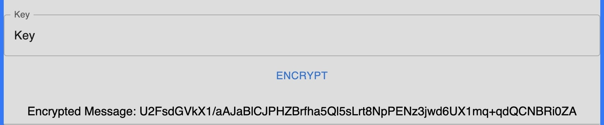
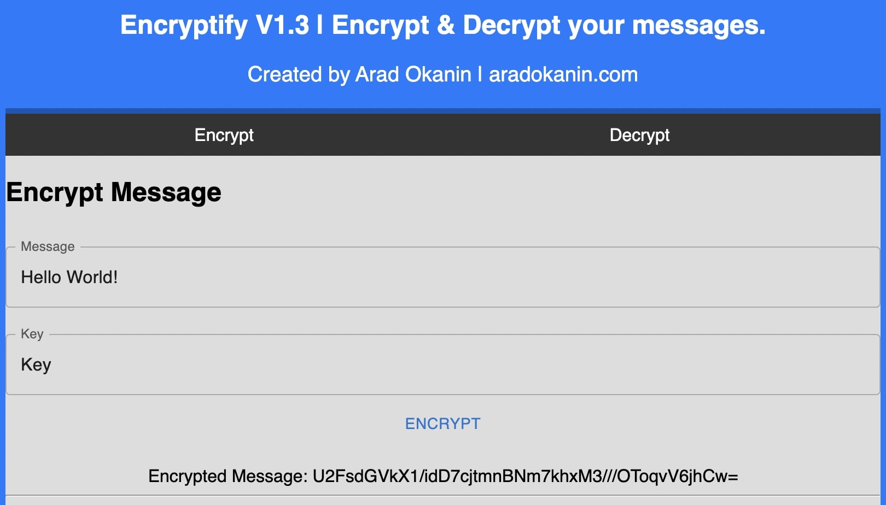

# Encryptify V1.3

## Introduction

Encryptify is a React-based web application designed to securely encrypt and decrypt messages. Utilizing advanced encryption algorithms, Encryptify offers a user-friendly interface to ensure your messages remain private and secure.

You can find a live version of this web app here: https://encryptify-frontend.vercel.app/

## Getting Started

### Prerequisites
- Node.js
- npm (Node Package Manager)

#### Installation
- Clone the repo:

```
git clone https://github.com/arad55500/encryptify-frontend.git
```

- Install NPM packages:

```
npm install
```

- Start the application:

```
npm run dev
```

This runs the app in development mode. Open http://localhost:5173 to view it in your browser.

## How to Use Encryptify

### To Encrypt a Message:
- Navigate to the 'Encrypt' tab.
- Enter your message in the 'Message' field.
- Enter your secret key in the 'Key' field.
- Press 'Encrypt' to see the encrypted message.

### To Decrypt a Message:
- Switch to the 'Decrypt' tab.
- Paste the encrypted message in the 'Encrypted Message' field.
- Enter the correct key in the 'Key' field.
- Press 'Decrypt' to reveal the original message.
- Note: The key used for encryption must be the same as the one used for decryption.

## Contributing
Contributions are what make the open-source community such an amazing place to learn, inspire, and create. Any contributions you make are greatly appreciated.

## Contact
Arad Okanin - aradokanin.com

## Screenshot



